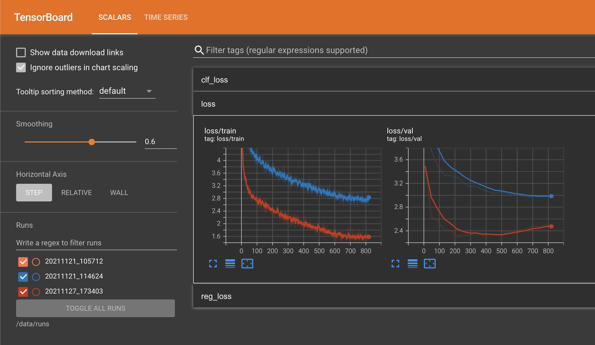

# w251-fall2021-project
Final Project for Fall 2021

1. Start up EC2 instance (g4pn.xlarge) with NVIDIA Deep Learning AMI and 500 GB - EBS storage. If you are connecting to a stopped instance, skip to step 4.

2. Clone project repository  
```git clone https://github.com/janehung04/w251-fall2021-project.git```

3. `cd w251-fall2021-project/`

3. Run [./setup.sh](setup.sh) which contains instructions for repo download.

4. Open Docker container  
```docker run --gpus all -it --rm -p 8888:8888 --shm-size=2048m -v "$PWD":/data/ nvcr.io/nvidia/pytorch:21.09-py3```

5. Move to the right directory in the Docker container  
```cd ../data```

6. Intsall requirements: opencv + pandas etc.  
`pip install -r requirements.txt`

7. Convert PNG to JPG  
`cd pytorch-ssd`
`python png_to_jpg.py data/helmet/`

8. Get the right imageset, which designates train/test/val splits  
`python vision/datasets/generate_vocdata.py labels.txt /data/pytorch-ssd/data/helmet`

9. Additional system requirements: for cv2 error --> ImportError: libGL.so.1: cannot open shared object file: No such file or directory  
`apt-get update`
`apt-get install ffmpeg libsm6 libxext6  -y`

10. Retrain using these images  
```python train_ssd.py --dataset_type voc --datasets /data/pytorch-ssd/data/helmet --validation_dataset /data/pytorch-ssd/data/helmet --net mb1-ssd --pretrained_ssd models/mobilenet-v1-ssd-mp-0_675.pth --scheduler cosine --lr 0.01 --t_max 100 --validation_epochs 5 --num_epochs 100 --base_net_lr 0.001  --batch_size 5```

11. New docker image used. Use on EC2 instance that is has been stopped.
```docker run --gpus all -it --rm -p 6006:6006 --shm-size=2048m -v "$PWD":/data/ jhung16/w251:latest```

12. Experiments:

|  experiment | command | notes | results | size |
| --- | --- | --- | --- | --- |
| 0 |`python train_ssd.py --dataset_type voc --datasets /data/pytorch-ssd/data/helmet --validation_dataset /data/pytorch-ssd/data/helmet --net mb1-ssd --pretrained_ssd models/mobilenet-v1-ssd-mp-0_675.pth --scheduler cosine --lr 0.01 --t_max 100 --validation_epochs 5 --num_epochs 100 --base_net_lr 0.001 --batch_size 5 --checkpoint_folder models/trial0/` | Initial Run | Val Loss @ Epoch 85 = 2.7810 | 27M |
| 1 |`python train_ssd.py --dataset_type voc --datasets /data/pytorch-ssd/data/helmet --validation_dataset /data/pytorch-ssd/data/helmet --net mb1-ssd --pretrained_ssd models/mobilenet-v1-ssd-mp-0_675.pth --scheduler cosine --lr 0.0001 --t_max 100 --validation_epochs 5 --num_epochs 100 --base_net_lr 0.001 --batch_size 5 --checkpoint_folder models/trial1/` | Decreased LR from 0.01 to 0.0001 | Val Loss @ Epoch 85 = 2.9807  | 27M |
| 2 |`python train_ssd.py --dataset_type voc --datasets /data/pytorch-ssd/data/helmet --validation_dataset /data/pytorch-ssd/data/helmet --net vgg16-ssd --pretrained_ssd models/vgg16-ssd-mp-0_7726.pth --scheduler cosine --lr 0.0001 --t_max 100 --validation_epochs 5 --num_epochs 100 --base_net_lr 0.001 --batch_size 5 --checkpoint_folder models/trial2/` | Switch to use pretrained vgg16-ssd | Val Loss @ Epoch 85 = 2.4852 | 92M |
| 3 |`python train_ssd.py --dataset_type voc --datasets /data/pytorch-ssd/data/helmet --validation_dataset /data/pytorch-ssd/data/helmet --net mb2-ssd-lite --pretrained_ssd models/mb2-ssd-lite-mp-0_686.pth --scheduler cosine --lr 0.0001 --t_max 100 --validation_epochs 5 --num_epochs 100 --base_net_lr 0.001 --batch_size 5 --checkpoint_folder models/trial3/` | Switch to use pretrained mb2 ssd lite  | Val Loss @ Epoch 85 = 2.8469 | 13M |
| 4 |`python train_ssd.py --dataset_type voc --datasets /data/pytorch-ssd/data/helmet --validation_dataset /data/pytorch-ssd/data/helmet --net mb2-ssd-lite --pretrained_ssd models/mb2-ssd-lite-mp-0_686.pth --scheduler cosine --lr 0.0001 --t_max 100 --validation_epochs 5 --num_epochs 200 --base_net_lr 0.001 --batch_size 5 --checkpoint_folder models/trial4/` | Switch to use pretrained mb2 ssd lite with more epochs to 200  | Val Loss @ Epoch 85 = 2.8320; Val Loss @ Epoch 199 = 3.01504 | 13M |
| 5 |`python train_ssd.py --dataset_type voc --datasets /data/pytorch-ssd/data/helmet --validation_dataset /data/pytorch-ssd/data/helmet --net mb1-ssd --pretrained_ssd models/mobilenet-v1-ssd-mp-0_675.pth --scheduler multi-step --lr 0.001 --milestones 20,40,60,80,100 --validation_epochs 5 --num_epochs 100 --base_net_lr 0.0001 --batch_size 50 --checkpoint_folder models/trial5/` | Decreased lr of base net and finetuning. Changed to multistep scheduler. Refer back to mb1-ssd since literature model is better. Increased batch size. Add milestones for scheduler. | Val Loss @ Epoch 85 = 3.9166 | 27M |
| 6 |`python train_ssd.py --dataset_type voc --datasets /data/pytorch-ssd/data/helmet --validation_dataset /data/pytorch-ssd/data/helmet --net mb1-ssd --pretrained_ssd models/mobilenet-v1-ssd-mp-0_675.pth --scheduler multi-step --lr 0.01 --milestones 80,100 --validation_epochs 5 --num_epochs 100 --base_net_lr 0.001 --batch_size 5 --checkpoint_folder models/trial6/` | Kept OG LR. Changed to multistep scheduler. Refer back to mb1-ssd since literature model is better. Return back to OG batch size. Add milestones for scheduler. | Val Loss @ Epoch 85 = 2.8394 | 27M |

14. Migrate model artifacts after each experiment to public s3 bucket:  
```aws s3 cp pytorch-ssd/models/trial2/ s3://jh-w251/helmet-final-project/trial2/ --recursive```

15. Run these commands in the Docker terminal ensuring that the logging directory is the same as shown in the script to open up Tensorboard or directory above.  
`pip install tensorboard`  
`tensorboard --logdir=/data/runs`  

Current Tensorboard:


16. Test on a sample image  

| trial | command |  inference time (s) |
| --- | --- | --- |
| 1 | `python run_ssd_example.py mb1-ssd models/trial1/mb1-ssd-Epoch-85-Loss-2.9806656360626222.pth models/trial1/voc-model-labels.txt data/helmet/JPEGImages/hard_hat_workers160.jpg` | 1.2786 |
| 2 | `python run_ssd_example.py vgg16-ssd models/trial2/vgg16-ssd-Epoch-85-Loss-2.485164252916972.pth models/trial2/voc-model-labels.txt data/helmet/JPEGImages/hard_hat_workers160.jpg` | 1.2908 |
| default | `python run_ssd_example.py mb1-ssd models/trial_default/hardhat.pth models/trial_default/voc-model-labels.txt data/helmet/JPEGImages/hard_hat_workers160.jpg` | 1.2930 |

17. Evaluat these models on the test set

| trial | command | Average Precision - helmet | Average Precision - person | Average Precision - head | Average Precision Across All Classes |
| --- | --- | --- | --- | --- | --- |
| 1 | `python eval_ssd.py --net mb1-ssd  --dataset /data/pytorch-ssd/data/helmet --trained_model models/trial1/mb1-ssd-Epoch-85-Loss-2.9806656360626222.pth --label_file models/trial1/voc-model-labels.txt` | 0.5744 | 0.0101 | 0.3726 | 0.3190 |
| 2 | `python eval_ssd.py --net vgg16-ssd  --dataset /data/pytorch-ssd/data/helmet --trained_model models/trial2/vgg16-ssd-Epoch-85-Loss-2.485164252916972.pth --label_file models/trial2/voc-model-labels.txt` | 0.7986 | 0.0058 | 0.6971 | 0.5005 |
| default | `python eval_ssd.py --net mb1-ssd  --dataset /data/pytorch-ssd/data/helmet --trained_model models/trial_default/hardhat.pth --label_file models/trial_default/voc-model-labels.txt` | 0.0043 | 8.7358e-06 | 0.0 | 0.0014 |


# Running in Jetson

1. Download github repository git clone https://github.com/smlblr/Real-Time-Detection-of-People-not-Wearing-Hardhat real-time-hardhat
2. Install the pytorch ssd (required for project). git clone https://github.com/qfgaohao/pytorch-ssd.git and copy the vision folder into real-time-hardhat
3. pip install torchvision==0.10.0
4. python3 detect_hardhat_video_webcam_demo.py --net-type=mb1-ssd --model=model/hardhat.pth --label=model/labels.txt

You should see an screen like the one below


